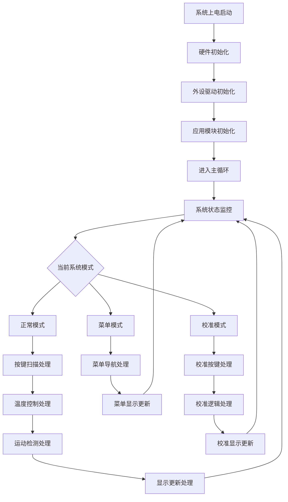
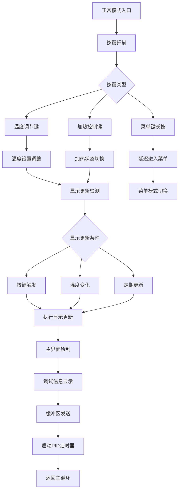
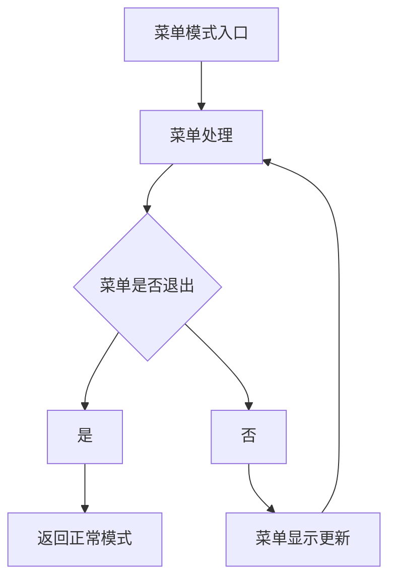
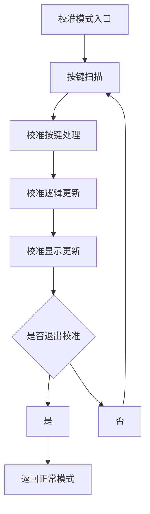

# STM32 T12烙铁控制器项目工作流程图

## 项目整体工作流程



## 详细工作流程说明

### 1. 系统启动阶段

#### 1.1 硬件初始化流程
```
系统上电 → HAL库初始化 → 系统时钟配置 → 外设初始化 → 应用模块初始化
```

**具体步骤：**
- **HAL_Init()**: 初始化HAL库
- **SystemClock_Config()**: 配置系统时钟（72MHz）
- **MX_GPIO_Init()**: GPIO初始化
- **MX_ADC1_Init()**: ADC温度采样初始化
- **MX_SPI2_Init()**: SPI OLED显示初始化
- **MX_TIMx_Init()**: 定时器初始化（TIM2-PID，TIM3/TIM4-LED）
- **System_Init()**: 系统级初始化

#### 1.2 应用模块初始化流程
```
LED初始化 → OLED显示初始化 → ADC校准 → 定时器配置 → 各功能模块初始化
```

**模块初始化顺序：**
1. **LED_Init()**: RGB LED PWM初始化
2. **Display_Init()**: OLED显示初始化，显示开机LOGO
3. **ADC_Init()**: ADC自动校准
4. **AppModules_Init()**: 应用模块统一初始化
   - Key_Init(): 按键处理初始化
   - St1xStatic_Init(): 运动检测初始化
   - CalibrationHardware_Init(): 校准硬件抽象层初始化
   - CalibrationSystem_Init(): 独立校准系统初始化

### 2. 主循环工作流程

#### 2.1 系统状态监控（始终运行）
```
系统状态监控 → 静置状态检查 → LED状态控制 → 模式切换处理
```

**核心监控任务：**
- **systemStatusMonitor()**: 系统状态监控（每循环执行）
- **静置检测**: 每秒检查一次运动状态
- **LED控制**: 统一的LED状态机管理
- **模式处理**: 根据当前模式调用相应处理函数

#### 2.2 正常模式工作流程



**正常模式关键功能：**

1. **按键处理逻辑：**
   - **KEY_UP/KEY_DOWN**: 温度设置调整（handleMainTemperatureAdjust）
   - **KEY_MODE**: 加热控制切换（handleHeatingControl）
   - **KEY_MODE_LONG**: 进入菜单模式（延迟200ms）

2. **显示更新机制：**
   - **触发条件**: 按键按下、温度变化>0.5°C、定期更新（100ms）
   - **显示内容**: 主界面温度显示 + 可选调试信息
   - **首次更新**: 启动TIM2中断（PID控制）

3. **温度控制流程：**
   ```
   TIM2中断触发 → 读取当前温度 → PID算法计算 → 调整加热功率 → 更新PWM输出
   ```

#### 2.3 菜单模式工作流程



**菜单模式特性：**
- **非阻塞式设计**: Menu_Process()函数处理菜单逻辑
- **多级菜单**: 支持层级导航
- **菜单项动作**: 执行相应的功能函数

#### 2.4 校准模式工作流程



### 3. 中断处理流程

#### 3.1 TIM2定时器中断（PID控制）
```
TIM2中断触发 → HAL_TIM_PeriodElapsedCallback → heatingControlTimerCallback → PID温度控制
```

**PID控制步骤：**
1. 读取当前温度值
2. 计算PID输出（比例+积分+微分）
3. 限制输出范围（0-100%）
4. 更新PWM占空比控制加热

#### 3.2 运动检测处理
```
定时运动检测 → 加速度数据读取 → 运动状态判断 → 静置时间累计 → 节能控制决策
```

### 4. 数据流与控制流

#### 4.1 温度数据流
```
T12烙铁头 → ADC采样 → 数字滤波 → 温度计算 → PID控制器 → PWM输出 → 加热控制
```

#### 4.2 用户交互数据流
```
按键输入 → 按键去抖 → 事件分类 → 模式切换 → 功能执行 → 显示反馈
```

#### 4.3 运动检测数据流
```
LIS2DW12传感器 → SPI读取 → 加速度计算 → 运动判断 → 状态更新 → 节能控制
```

## 关键时序要求

### 实时性要求
1. **PID控制周期**: 10ms（TIM2定时器）
2. **显示更新周期**: 100ms
3. **按键扫描周期**: 主循环频率
4. **运动检测周期**: 1秒

### 优先级顺序
1. **安全保护**: 最高优先级（过温、过压保护）
2. **温度控制**: 高优先级（确保温度稳定）
3. **用户交互**: 中优先级（响应及时）
4. **显示更新**: 低优先级（避免频繁刷新）

## 状态转换条件

### 模式切换条件
- **正常模式 → 菜单模式**: MODE键长按（>2秒）
- **菜单模式 → 正常模式**: 菜单退出或超时
- **正常模式 → 校准模式**: 通过菜单进入
- **校准模式 → 正常模式**: 校准完成或取消

### 加热状态转换
- **启动加热**: MODE键短按（加热状态为0时）
- **停止加热**: MODE键短按（加热状态为1时）
- **自动停止**: 静置超时或安全保护触发

这个工作流程图清晰地展示了STM32 T12烙铁控制器项目的完整工作流程，从系统启动到各个模式的处理逻辑，以及关键的数据流和控制时序。