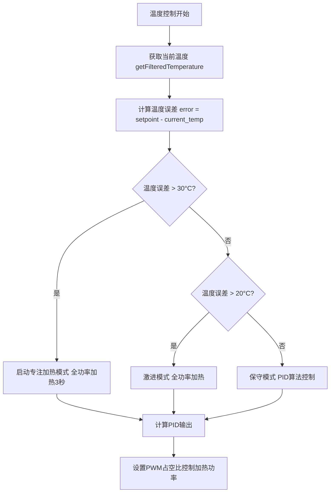
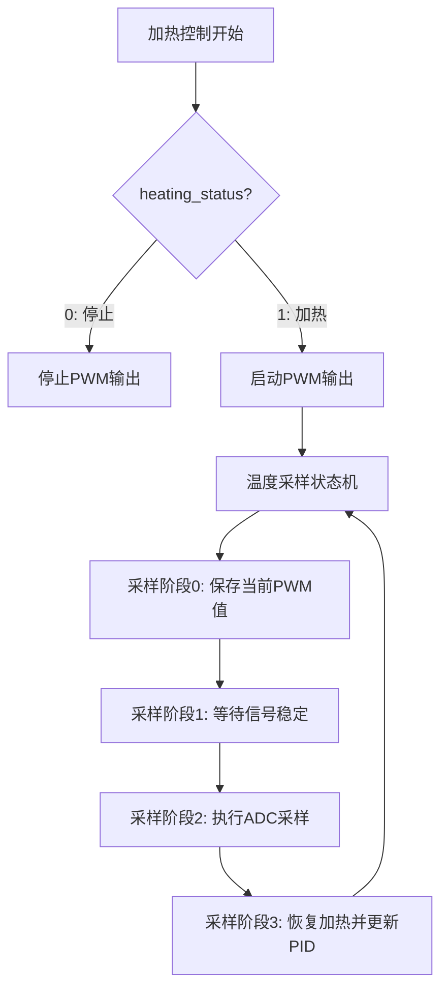
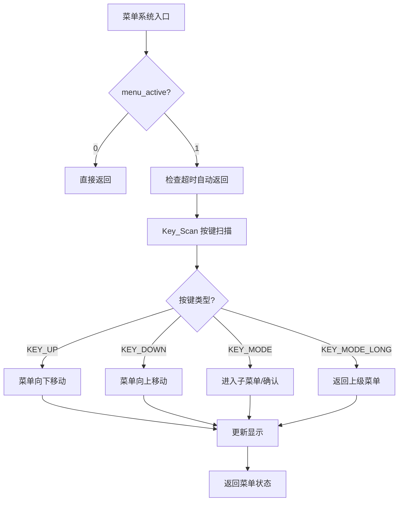
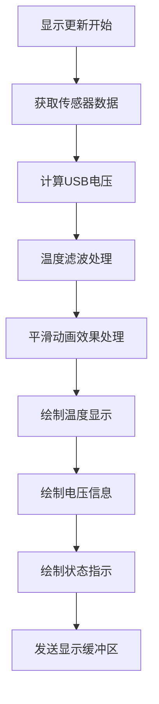
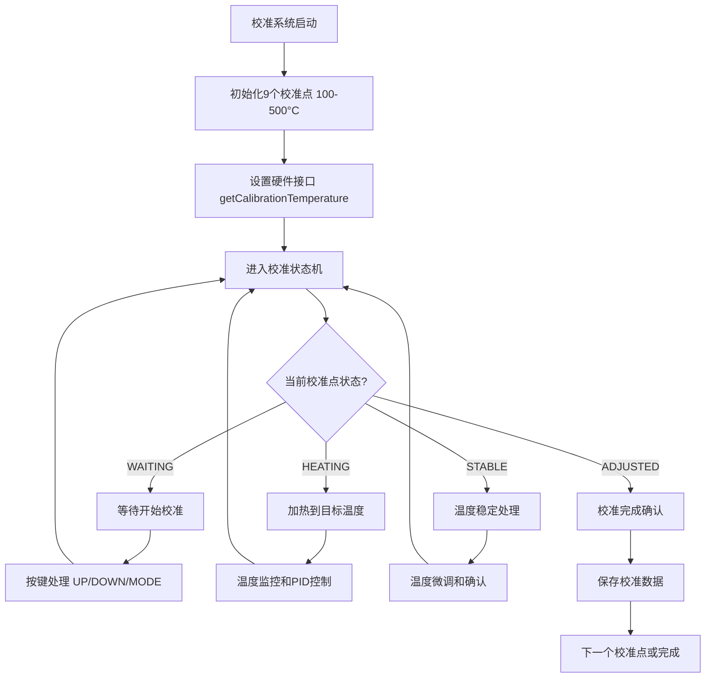
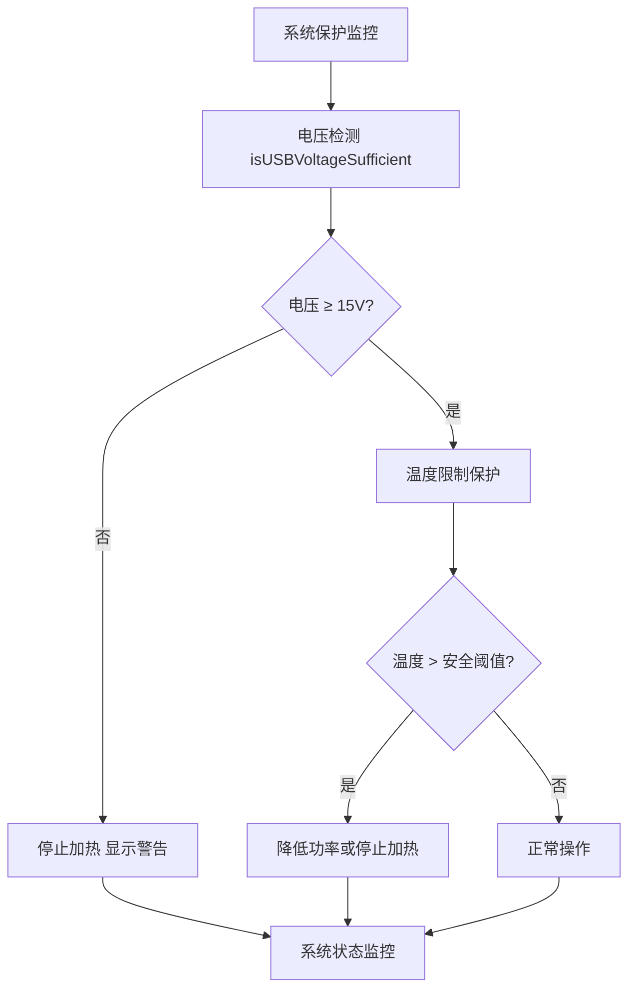

# St1x T12烙铁控制器 - 系统工作流程思维导图

## 🏗️ 系统架构概览

```
┌───────────────────────────────────────────────────────────────────┐
│                    STM32F103CBTx 主控制器                          │
├───────────────────────────────────────────────────────────────────┤
│  Core/ (HAL驱动层)        St1xDrivers/ (应用层)                    │
│  ├─ main.c (主循环)        ├─ St1xADC.c (温度测量)                 │
│  ├─ 外设初始化             ├─ St1xPID.c (温度控制)                  │
│  └─ 系统时钟配置           ├─ St1xMenu.c (菜单系统)                 │
│                            ├─ St1xKey.c (按键处理)                 │
│                            ├─ St1xCalibrationSystem.c (烙铁头校准) │
│                            └─ u8g2_oled.c (OLED显示)               │
└───────────────────────────────────────────────────────────────────┘
```

## 🔄 主系统工作流程

### 1. 系统启动流程
```mermaid
graph TD
    A[上电复位] --> B[HAL_Init 硬件抽象层初始化]
    B --> C[SystemClock_Config 系统时钟配置]
    C --> D[外设初始化 GPIO/ADC/SPI/TIM/I2C/USB]
    D --> E[System_Init 系统初始化]
    E --> F[进入主循环 while(1)]
```

### 2. 主循环执行流程
```mermaid
graph TD
    A[主循环开始] --> B[systemStatusMonitor 系统状态监控]
    B --> C[St1xStatic_DisplayData 静置状态检查]
    C --> D[System_ModeHandler 系统模式处理]
    D --> E{当前系统模式?}
    E -->|正常模式| F[System_NormalModeHandler]
    E -->|菜单模式| G[System_MenuModeHandler]
    E -->|校准模式| H[System_CalibrationModeHandler]
    F --> I[HAL_Delay(10ms) 延时]
    G --> I
    H --> I
    I --> A
```

## 🌡️ 温度控制系统

### 3. 温度测量流程 (St1xADC.c)
```mermaid
graph TD
    A[温度测量开始] --> B[ADC采样 DMA_ADC[0] 获取原始值]
    B --> C[calculateT12Temperature 温度计算]
    C --> D[电压转换: ADC值 → 电压值]
    D --> E[温度转换: 电压值 → 摄氏度]
    E --> F{是否为校准系统?}
    F -->|是| G[getCalibrationTemperature 无限制温度]
    F -->|否| H[getFilteredTemperature 0-460°C限制]
    G --> I[返回原始温度值]
    H --> J[温度滤波处理]
    J --> K[返回滤波后温度]
```

### 4. PID温度控制流程 (St1xPID.c)


### 5. 加热控制状态机


## 📱 用户交互系统

### 6. 菜单系统流程 (St1xMenu.c)


### 7. OLED显示流程 (u8g2_oled.c)


## 🔧 校准系统工作流程

### 8. 独立校准系统流程 (St1xCalibrationSystem.c)


### 9. 校准硬件抽象层 (St1xCalibrationHardware.c)
```mermaid
graph TD
    A[硬件接口调用] --> B[getCalibrationTemperature]
    B --> C[直接读取DMA_ADC[0]原始值]
    C --> D[电压转换计算]
    D --> E[温度计算 无460°C限制]
    E --> F[仅下限保护 temperature ≥ 0]
    F --> G[返回真实温度值]
```

## ⚡ 关键数据流

### 10. 温度数据流
```
传感器 → ADC采样 → DMA_ADC[0] → 温度计算 → 温度滤波 → PID控制 → PWM输出 → 加热器
```

### 11. 用户指令流
```
按键输入 → 按键扫描 → 菜单处理 → 温度设置 → PID设定点更新 → 温度控制循环
```

### 12. 显示数据流
```
传感器数据 → 滤波处理 → 动画平滑 → OLED绘制 → 屏幕显示
```

## 🛡️ 安全保护机制

### 13. 系统保护流程


## 📊 性能优化特性

### 14. 系统响应优化
- **主循环频率**: 100Hz (10ms间隔)
- **温度控制频率**: 20Hz (50ms间隔) 
- **显示更新频率**: 20Hz (50ms间隔)
- **按键响应**: 实时检测
- **温度采样**: 4点滤波 + 显示8点滤波

### 15. 温度控制策略
- **专注加热模式**: 温差>30°C时全功率加热3秒
- **激进模式**: 温差>20°C时全功率加热
- **保守模式**: PID精确控制
- **温度平滑**: 指数平滑算法显示

## 🔄 模块间依赖关系

```
main.c (主控)
    ↓
St1xADC.c (温度测量) ←→ St1xPID.c (温度控制)
    ↓
St1xMenu.c (用户界面) ←→ St1xKey.c (输入)
    ↓
u8g2_oled.c (显示输出)
    ↓
St1xCalibrationSystem.c (校准) ←→ St1xCalibrationHardware.c (硬件抽象)
```

这个思维导图完整展示了St1x T12烙铁控制器的工作流程，从硬件初始化到用户交互，再到温度控制和系统保护的全过程。